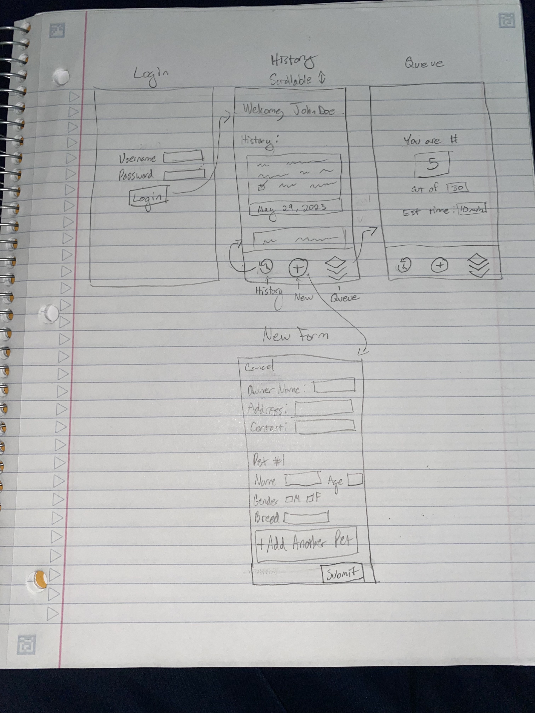

# SPCA Forms/Payment/Queue screens

## Description deliverable

### Elevator pitch

My mom is the president of our local SPCA, a non-profit dedicated to animal welfare. Like many non-profits, they are signicantly behind in technology because they simply lack have the funds to pay someone to create custom software or webpages for them. For example, at every event, all patrons must stand in line to fill out a paper form, then stand in another line to pay at a physical credit card machine or cash box, and then wait around for someone to call out their name. The organization pays for these paper forms to be printed (300 forms almost every week), and then they save them for multiple years for tax and grant purposes. There are thousands, maybe tens of thousands, of forms in my house and my mom can never find the ones she needs. Most of this could be simplified with a couple webpages: an online form that saves to a database of customers and pets and a live queue that notifies customers when they're next in line. 

### Design

### Key features

- Secure login over HTTPS
- Allows customers to view their past records
- Form with text-entry boxes for paperwork
- A live queue tracking where each customer is in line
- Live notifications to the next three customers in the queue
- Database where customer/pet information is stored

There's other functionality I want to build out for this in real life, like a payment screen and a searchable database for admin, but I think I can meet all the requirements of the assignment without those so I will leave them out for now.

### Technologies

I am going to use the required technologies in the following ways.

- **HTML** - Uses correct HTML structure for application. Four HTML pages: one for login, one for record history, one for form entry, and one to show status in the queue.
- **CSS** - Application styling that looks good on different screen sizes, uses good whitespace, color choice and contrast.
- **JavaScript** - Provides login, dynamic form updates (eg add another pet to the form), queue updates, backend endpoint calls.
- **Service** - Backend service with endpoints for:
  - login
  - retrieving user's record history
  - submitting form to database
  - updating queue status
- **DB** - Store customers and their pet information in database.
- **Login** - Register and login customers. Credentials securely stored in database. Can't submit a new form or view history unless authenticated.
- **WebSocket** - As the queue moves forward, the information is broadcast to all customers in line.
- **React** - Application ported to use the React web framework.

## HTML deliverable

For this deliverable I built out the structure of my application using HTML.

- **HTML pages** - Four HTML pages that represent the ability to login, view history, view queue, and submit a new vaccine form.
- **Links** - The login page and new form page both automatically link to the history page. All pages contain links to all other pages to represent a future hamburger model; I may change this so that the Login does not include links to others and those are only visible once authenticated, but that might be more effort than it's worth.
- **Text** - The history page uses text to show previous records submitted by the user. The queue page uses text to represent the queue information.
- **Images** - There is an image of a dog on the login page.
- **Login** - The "new form" page has lots of input, mostly text boxes but also a set of radio buttons and checkboxes. Also the login page has input.
- **Database** - The history page represents data pulled from the database of users' previous records.
- **WebSocket** - The queue page uses websockets to update the queue live as users in the queue are sent into the clinic and removed from the queue.

## CSS deliverable

For this deliverable I properly styled the application into its final appearance.

- **Header, footer, and main content body**
- **Navigation elements** - I converted it from a bulleted list with no coloring or formatting to a stylish navigation bar using references from Bootstrap and Simon, though I changed a few things to better suit what I wanted.
- **Responsive to window resizing** - My app looks great on all window sizes and devices.
- **Application elements** - The queue page has certain elements highlighted with color and shadow, and an alert at the top representing web socket information. The New Form page has a well-formatted form with multiple input types and buttons. The History page shows a table with shading for contrast. And the homepage/login page contains a login screen with many Bootstrap components.
- **Application text content** - Fonts are consistent, text is relatively uniform, with the exception of color/size changes to highlight important information such as headings or the relevant numbers on the queue page.
- **Application images** - The image on the main/login page has padding and a colored background, as well as a box shadow and border radius.

## JavaScript deliverable

For this deliverable I implemented by JavaScript so that the application works for a single user. I also added placeholders for future technology.

- **login** - When you press the login button it saves your username and takes you to the history page, displaying your username.
- **database** - The user's history is displayed on the history page. Currenlty this is stored and retrieved from local storage, but it will be replaced with the database data later.
- **WebSocket** - I used the setInterval function to periodically generate an alert about moving up in the queue. It also periodocially updates the length of the queue and the estimated wait time. This will be replaced with WebSocket messages later.
- **application logic** - On the page to submit a new form, clicking "Add Another Pet" creates a new section on the form. Submitting the form updates The highlight and ranking number change based up the user's selections.

## Service deliverable

For this deliverable I added backend endpoints that receive new form submissions and return the user's form history. I accidentally messed up the version control at one point ([read here](https://github.com/optimisms/startup/pull/1) for more details) so there are less commits than there should be and than I normally include.

- **Node.js/Express HTTP service** - See [index.js](index.js).
- **Static middleware for frontend** - See [index.js](index.js) with the use of `app.use(express.static('public'));` and `app.use(express.json());`.
- **Calls to third party endpoints** - Called in the new file at [thirdparty.js](public/js/thirdparty.js) and displayed on the History page.
- **Backend service endpoints** - Endpoints for submitting a new form (`/api/form`) and retrieving history (`/api/history`). 
- **Frontend calls service endpoints** - Both endpoints are called using the `fetch` function in [submitform.js](public/js/submitform.js) and [history.js](public/js/history.js).

## DB deliverable

For this deliverable I stored form input in the database.

- **MongoDB Atlas database created** - done!
- **Endpoints for data** - My API endpoints process the data and send it to MongoDB in [index.js](index.js).
- **Stores data in MongoDB** - See [database.js](database.js) for the calls to insert and retrieve from the data.

## Login deliverable

For this deliverable I enabled users to create accounts and login. 

- **User registration** - Creates a new account in the database.
- **Existing user login** - Existing users can login; logging in with bad credentials or creating a user with existing username fails.
- **Use MongoDB to store credentials** - Stores user login info (username, hashed password, and token).
- **Restricts functionality** - You cannot view history or submit a new form unless you're logged in.
